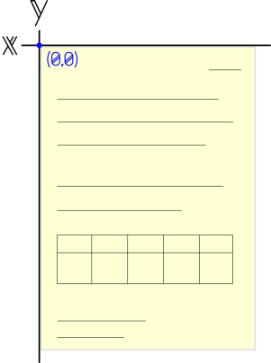

# PDFBox-Co-ordinates-of-text
This PDFBox wrapper that can be used for extracting text and text co-ordinates from a printed PDF doc (no OCR)

## Dependencies

* [JRE 8 or above]
* [Nodejs 8 or above](https://nodejs.org/en/) - only if you want to build from source(http://www.oracle.com/technetwork/java/javase/downloads/jre8-downloads-2133155.html)
* [PDFBox v2 or above](https://pdfbox.apache.org/) - only if you want to build from source

> Note: Neither the binaries, nor the source files will work without the *Java Runtime Environment (JRE)*

## Usage (Windows)

After cloning the repository, copy the ```main_java.exe``` and the ```BoomPdf.jar``` files to the desired folder. Make sure you have nodejs installed and then run the following code in the ```command prompt```: 

```
I:\Path> node main_java.exe "Absolute Path of the PDF" FromPage ToPage
```
Where ```I:\Path>``` is the folder path (don't type this in, it will show up by default once you navigate to the folder using ```cd```), ```FromPage``` is the first page you want to convert and ```ToPage``` is the end page
___
**The zero position/origin (0,0) is on the top right corner of the page:**


___
### Build From Source (Linux and OS X)
Out of the box, ```BoomPdf.java``` returns each glyph/alphabet and special character with coordinates.

If you're building the code from source, please download [the PDFBox jar](https://pdfbox.apache.org/) and use the ```BoomPdf.java``` file to customize your solution. 

Further customization in the output can be done by altering the ```main_java.js``` file. This is the Node.js code that parses the text and returns words with their coordinates (the left-most character's position is taken for reference)

## License
The main code of this project is licensed under the Apache 2.0 License, found at http://www.apache.org/licenses/LICENSE-2.0.html Any code released under a different licenses will be stated in the header.